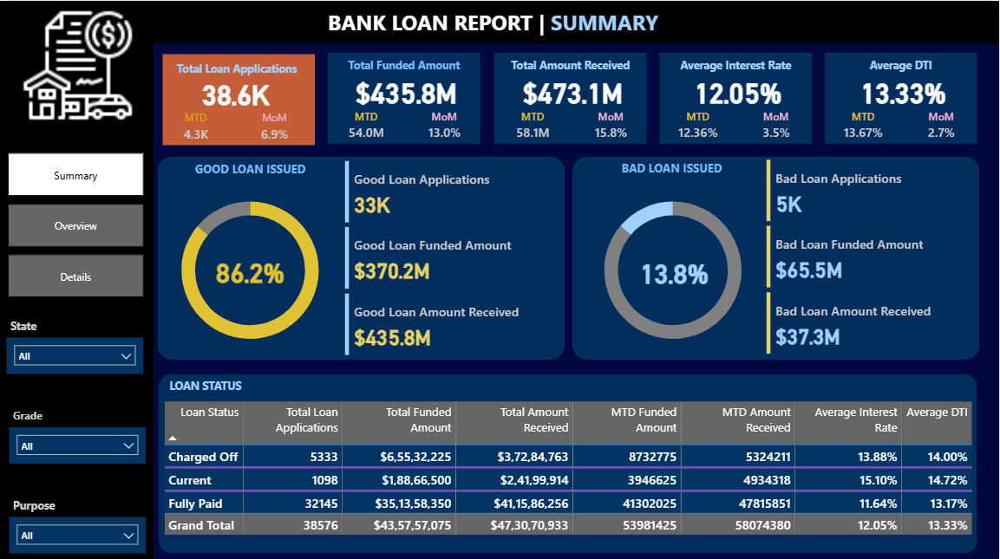
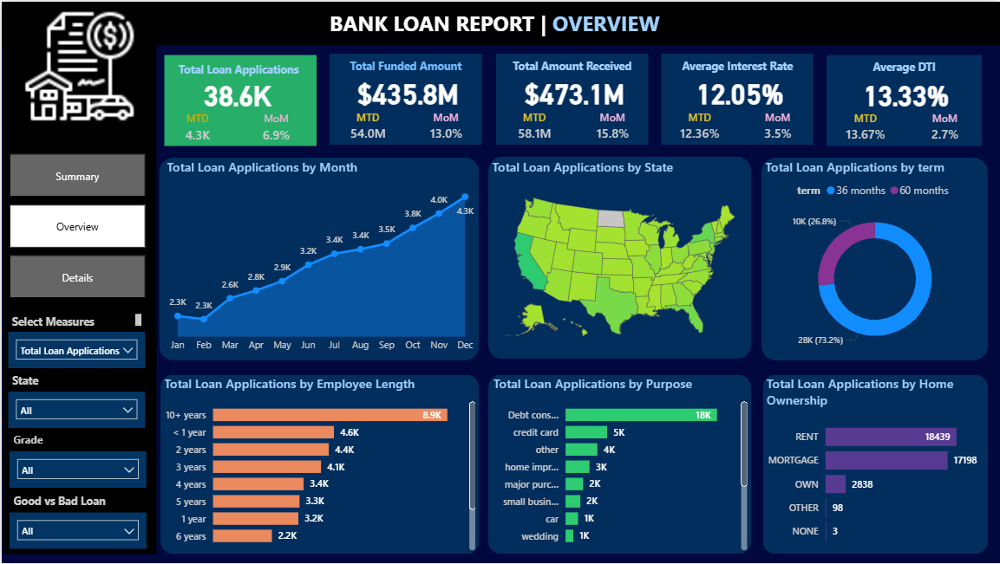
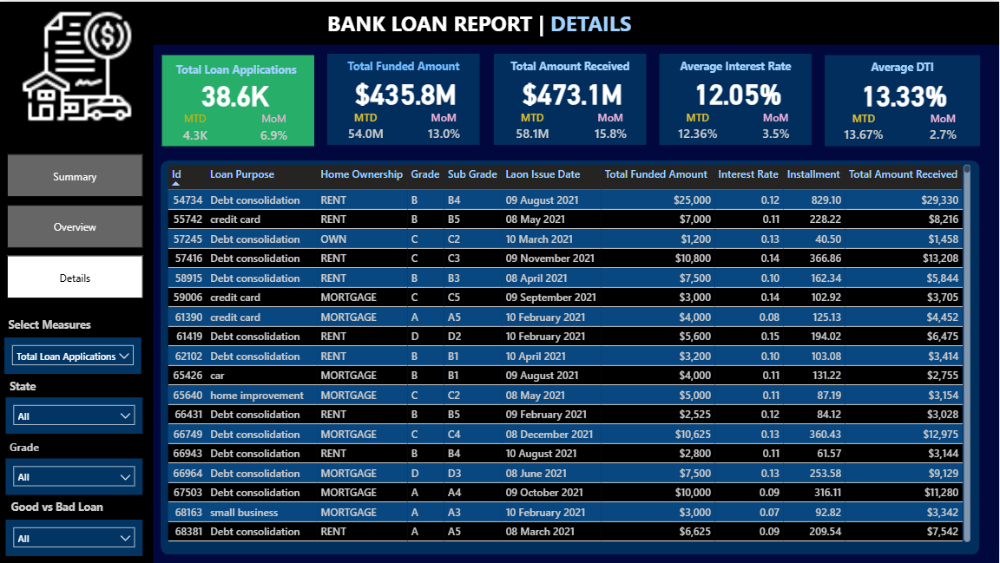

# 🏦 **Bank Loan Analysis Project – Power BI Interactive Dashboard**

This project showcases a fully interactive **Power BI dashboard** designed to analyze and monitor a bank’s lending operations. It focuses on loan applications, funded amounts, repayments, borrower profiles, and loan performance. The dashboard leverages Power BI’s advanced data modeling, dynamic visuals, and DAX measures to support strategic, data-driven decision-making.

---

# 📸 **Dashboard Snapshots**

### **Summary Dashboard**

Dashboard 1: Portfolio KPI Overview

### **Overview Dashboard**

Dashboard 2: Visual Trends, Geographic Insights & Borrower Behaviors

### **Details Dashboard**

Dashboard 3: Loan-level drilldown with interactive slicers

---

# 📝 **Project Description**

The goal of this project is to build a **dynamic Bank Loan Report in Power BI** to:

* Evaluate overall lending performance
* Compare Good vs. Bad loan segments
* Identify regional and categorical patterns
* Monitor repayments and cash inflow
* Analyze borrower characteristics and loan purpose behavior

The dashboards enable decision-makers to explore trends from multiple perspectives with interactive filters, slicers, and DAX-powered metrics.

---

# 📁 **Files Included**

**Bank_Loan Power BI Project.pbix** – Complete dashboards, data model, DAX measures, and cleaned dataset

---

# 📊 **Dashboards Overview**

## 📍 **Dashboard 1: Summary**

Key KPIs include:

* Total Loan Applications (MTD & MoM)
* Total Funded Amount
* Total Amount Received
* Average Interest Rate
* Average Debt-to-Income Ratio
* Good vs. Bad Loan KPIs
* Loan Status Summary Cards & Conditional Indicators

---

## 📍 **Dashboard 2: Overview**

Interactive visuals include:

* **Line Chart:** Monthly Application, Funded, and Received Trends
* **Filled Map:** Loans by U.S. States
* **Donut Chart:** Loan Terms (36 vs 60 Months)
* **Bar Charts:** Employment Length, Loan Purpose Breakdown
* **Tree Map:** Home Ownership Categories
* **Clustered Bars:** Good vs. Bad Loan Comparison

---

## 📍 **Dashboard 3: Details**

* Table view for raw loan and borrower insights
* Slicers for **State**, **Loan Status**, **Home Ownership**, **Term**, **Purpose**, etc.
* Complete visibility into loan-level metrics and borrower financials

---

# 📌 **KPIs Covered**

### 📈 **General KPIs**

* Total Applications
* Total Funded Amount
* Total Amount Received
* MoM & MTD Metrics
* Average Interest Rate
* Average DTI

---

### ✅ **Good Loan KPIs**

* Loan Status: Fully Paid / Current
* Good Loan Applications
* Good Loan Funded Amount
* Good Loan Amount Received

---

### ❌ **Bad Loan KPIs**

* Loan Status: Charged Off
* Bad Loan Applications
* Bad Loan Funded Amount
* Bad Loan Amount Received

---

# 🛠️ **Tools & Techniques Used**

* **Power BI Desktop**
* Data Modeling (Star Schema)
* Power Query (ETL & Data Cleaning)
* DAX Measures & Calculated Columns
* Interactive Charts & Custom Visuals
* Slicers & Filters for User-driven Exploration
* Conditional Formatting & KPI Cards
* Drillthrough pages & cross-filtering

---

# 🎯 **Key Insights**

* Good Loans make up the majority of the portfolio with strong repayment performance
* Regional differences show varying loan volumes across states
* Most borrowers prefer **36-month loan terms**
* Borrowers with longer employment histories secure larger loan amounts
* **Debt Consolidation** remains the most common loan purpose
* Borrowers who own or mortgage homes tend to have more reliable repayment patterns

---

# 📝 **License**

© Rajendra Singh Shah. For educational and portfolio use only.

